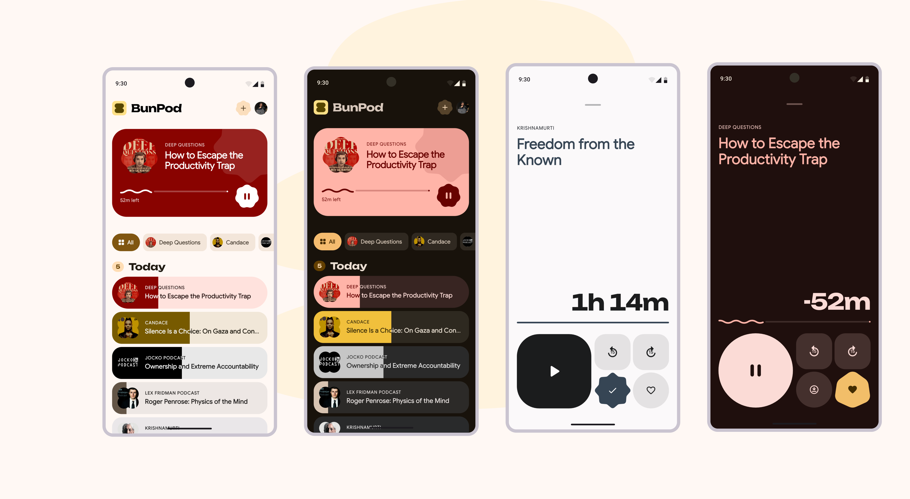

  

<h1 align="center">BunPod</h1>

  An open-source podcast player — Flutter, M3 Expressive and Serverpod!

---

## Roadmap

🚧 BunPod is a work in progress. If you want to follow the progress, follow me on X at <a href="https://x.com/kamranbekirovyz" target="_blank" rel="noopener">@kamranbekirovyz</a>. If you notice any issues, please <a href="https://github.com/kamranbekirovyz/bunpod/issues" target="_blank" rel="noopener">open an issue</a>.

First the UI:

- [x] Home page UI
- [ ] Player page UI _(in progress)_
- [ ] Channel page UI
- [ ] Menu page UI
- [ ] Downloads page UI
- [ ] Feedback page UI

Then the backend:

- [ ] Serverpod API & data layer
- [ ] Force update mechanism

---

<i>I build Flutter apps — <a href="https://kamranbekirov.com" target="_blank" rel="noopener">kamranbekirov.com</a></i>

